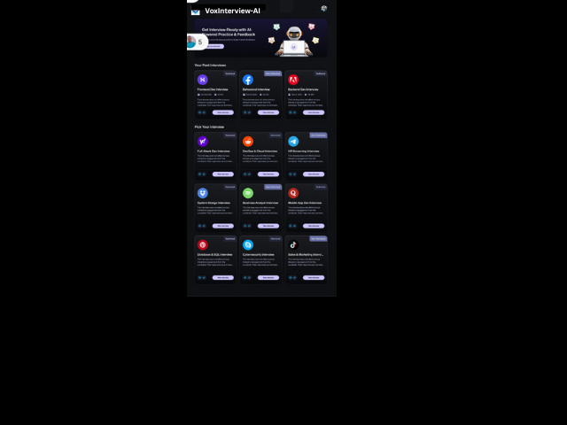
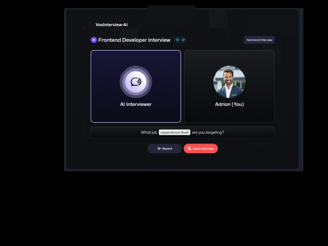
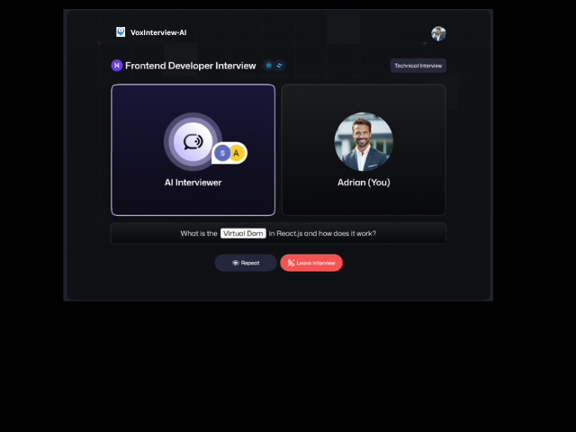
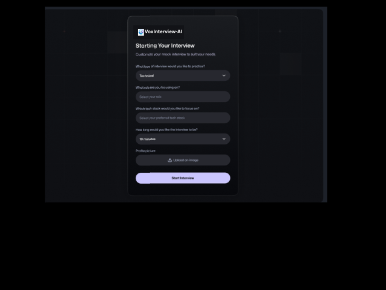

**🎙️ VoxInterview AI – AI Voice Agent Interview Platform**

VoxInterview AI is a modern AI-powered voice interview preparation platform that helps users practice coding interviews anytime. It combines Next.js, Firebase, Tailwind CSS, ShadCN, and VY Voice SDK with Gemini AI to simulate lifelike interview conversations.

Users can choose interview types, speak naturally, interact with a voice agent, and receive detailed AI-generated feedback after each session.

---

**🚀 Features**

**🔐 Secure Authentication**

    -> Firebase Authentication (email + password)

    -> Server-side session cookies (Next.js App Router)

    -> Error handling for existing accounts

    -> Toast notifications for UX

**📝 Mock Interview Creation**

    -> Select technologies (React, Python, Java, etc.)

    -> Choose interview format

    -> Create custom AI interview sessions

    -> OTP-style account security (from Firebase)

**🎤 AI Voice Interview Agent**

    -> Real-time voice conversations via VY Web SDK

    -> Powered by Gemini AI interviewer prompts

    -> Human-like conversation flow

    -> Tracks speaking states (AI / User)

    -> Dynamic call status UI

**📊 Interview Management**

    -> Save interviews to Firestore

    -> Fetch interview history

    -> View interview cards with tech icons

    -> Dynamic routing for interview details

    -> Efficient Firebase queries with required indexes

**🧠 AI Feedback Generator**

    -> Structured transcript → AI evaluator

    -> Strengths, weaknesses, improvements

    -> Role-based feedback (Front-end, Backend, DSA, System Design)

    -> Retake interview option

**🌙 Modern UI & Styling**

    -> Next.js App Router

    -> ShadCN UI components

    -> Tailwind CSS (dark mode)

    -> Reusable components

    -> Mona Sans font for premium look

**📂 Backend Integrations**

    -> Firebase Admin SDK for secure reads

    -> Firestore database for interviews

    -> VY SDK for voice communication

-----

**🧰 Tech Stack**

**Frontend**

    -> Next.js 14 (App Router)

    -> TypeScript

    -> Tailwind CSS

    -> ShadCN UI

**Backend**

    -> Firebase Admin

    -> Firebase Firestore

    -> Server Actions (Next.js)

**AI & Voice**

    -> Gemini AI

    -> VY Voice AI (real-time audio streaming)

    ---

**📁 Folder Structure**

VoxInterview-AI/

│

├── app/

│   ├── (auth)/         # Login / Signup

│   ├── (dashboard)/    # User dashboard

│   ├── interview/      # Interview pages

│   ├── feedback/       # Feedback screens

│   ├── api/            # API routes (server actions)

│   └── layout.tsx

│

├── components/

│   ├── ui/             # ShadCN components

│   ├── forms/          # Input, selector components

│   ├── interview/      # Voice UI, cards, statuses

│   └── feedback/       # Feedback UIs

│

├── lib/

│   ├── firebase.ts     # Firebase client setup

│   ├── admin.ts        # Firebase admin

│   ├── auth.ts         # Session logic

│   └── utils.ts

│

├── types/

│   ├── interview.ts

│   ├── user.ts

│   └── feedback.ts

│

├── public/

│   ├── icons/

│   └── screenshots/

│

├── .env.local

├── package.json

└── README.md

  -------  

**⚙️ Installation Guide**

**1️⃣ Clone the Repository**

git clone https://github.com/shraddha524/VoxInterview-AI.git

cd VoxInterview-AI

----

**2️⃣ Install Dependencies**

npm install

---

**3️⃣ Setup Environment Variables**

Create .env.local:

FIREBASE_API_KEY=your_key

FIREBASE_AUTH_DOMAIN=your_domain

FIREBASE_PROJECT_ID=your_project

FIREBASE_STORAGE_BUCKET=your_bucket

FIREBASE_MESSAGING_SENDER_ID=your_sender

FIREBASE_APP_ID=your_app_id

FIREBASE_ADMIN_PRIVATE_KEY="your_admin_key"

FIREBASE_ADMIN_CLIENT_EMAIL=your_client_email

VY_API_KEY=your_vy_key

GEMINI_API_KEY=your_key

----

**Screenshots**

---

### **Authentication**

---

### **Dashboard**

---

### **Interview Workflow**

---

### **Interview Page**

---

### **Interview Confirmation**

